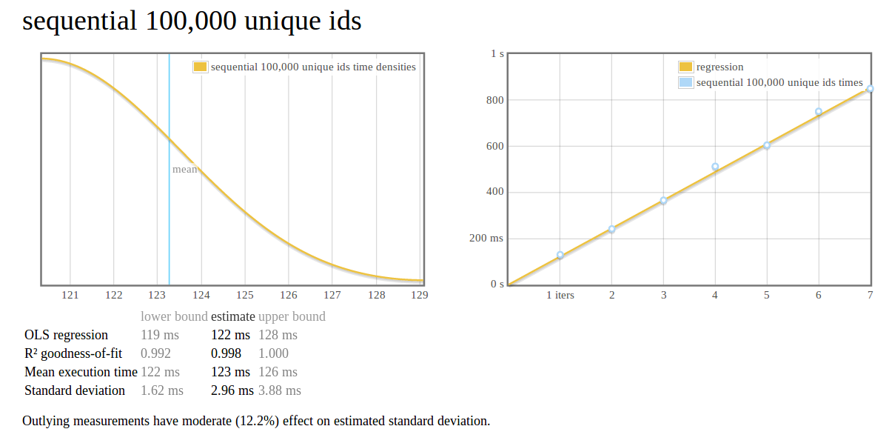

# Blacktip


Blacktip is a k-ordered unique id service and a clone of Boundary's Flake.

## Benchmarks

### Blacktip



### Flake

```
(flake@127.0.0.1)11> flake_harness:timed_generate(100000).
src/flake_harness.erl:33:<0.75.0>: generating ids: 0.272 s
```

## Exceptional cases / Warnings

### This is a singleton service, ONE INSTANCE PER SERVER/MAC ADDRESS

Do not embed this unless:

1. You don't care about globally unique identities (then why do you need this?)

2. You can guarantee there will be one instance of this running per server / MAC address.

### System time

If system time flows backwards (this *can* happen), `Database.Blacktip.Types.ArrowOfTimeError` will be thrown.

This possibility could be eliminated by making an FFI wrapper for the monotonic system clock.

### Sequence bounds checking

Currently there's no bounds checking on sequence. We start at 0 on a 16-bit signed integer. We're getting ~1500 uids per millisecond, we would need to exceed 32,767 (or 65,535 if we let negative numbers fly). We could flip it over to a Word16, which would at least eliminate the weirdness of negative sequence numbers but doesn't change anything at the bit level.

Possible solution would be to add bounds checking and yield. MVar has fairness and queue-like properties so this is a reasonable solution. For now, not a realistic possibility.

### Timestamp file doesn't exist

Following the convention of existing implementations, we default the timestamp to 0 if there is no timestamp file at the location specified in the `Database.Blacktip.Types.Config` passed to `generateUniqueId`.

### Timestamp file contains empty bits

Seems to be an artifact of something criterion (the benchmarks) does. Can't reproduce outside that, so defaulting timestamp to 0 when that happens.
